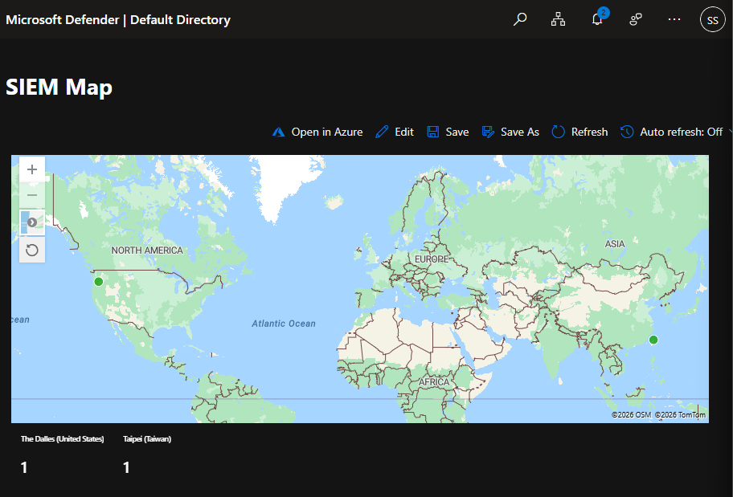

# Home SIEM lab using Azure Honeypot + Microsoft Sentinel 

Built a small cloud-based detection lab to practice security operations fundamentals: log generation, centralised collection, KQL querying, enrichment, and visualisation.

## Overview
This project deploys a **Windows VM honeypot in Azure**, forwards logs to a **Log Analytics Workspace**, connects **Microsoft Sentinel** as the SIEM, and displays failed login events using a **GeoIP watchlist** which was further used to build an **attack map workbook**.

## Goals
- Practice real-world SOC skills: log collection, triage, and investigation
- Learn core Azure security flow (VM → LAW → Sentinel)
- Build confidence writing KQL queries for detection and analysis
- Enrich raw events with contextual data (GeoIP) for better visibility

## Tech Stack
- **Azure Virtual Machine (Windows 11 pro)**
- **Network Security Group (NSG)**
- **Azure Monitor Agent (AMA) + Data Collection Rule (DCR)**
- **Log Analytics Workspace (LAW)**
- **Microsoft Sentinel (SIEM)**
- **KQL (Kusto Query Language)**
- **Sentinel Watchlists (GeoIP enrichment)**
- **Sentinel Workbooks (Attack map visualisation)**

## Key Steps Completed
1. Created an Azure subscription and deployed a Windows 11 pro VM (honeypot).
2. Configured NSG inbound rule to allow inbound traffic (honeypot exposure for log generation).
3. Generated failed authentication events (Event ID **4625**) using test login attempts.
4. Forwarded Windows security events into a Log Analytics Workspace.
5. Queried logs in LAW/Sentinel using KQL to validate event flow and investigate activity.
6. Imported GeoIP CSV as a Sentinel watchlist and enriched logs via `ipv4_lookup`.
7. Built a Sentinel Workbook that visualises failed logins by geographic source (attack map).

## Sample KQL Queries

### 1) Failed Logons (Event ID 4625)
```kql
SecurityEvent
| where EventId == 4625
| order by TimeGenerated desc
```


###  2) GeoIP Enrichment via Watchlist
```kql
    let GeoIPDB_FULL = _GetWatchlist("geoip");
    SecurityEvent
    | where EventID == 4625
    | evaluate ipv4_lookup(GeoIPDB_FULL, IpAddress, network)
    | project TimeGenerated, Account, IpAddress, cityname, countryname, latitude, longitude
    | order by TimeGenerated desc
```

## Screenshots

### 1) Failed Logons (Event ID 4625)


